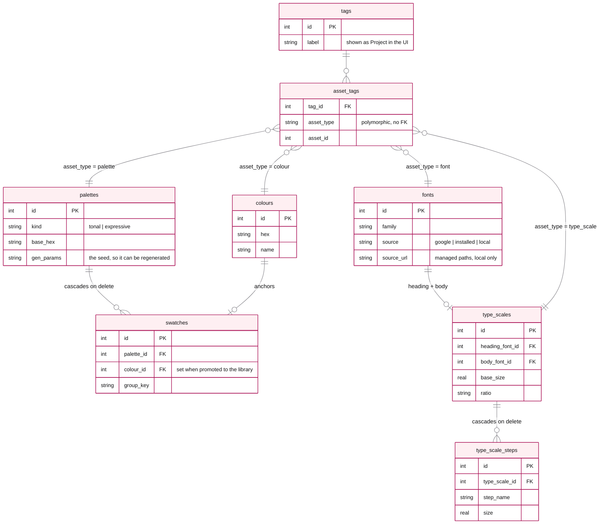
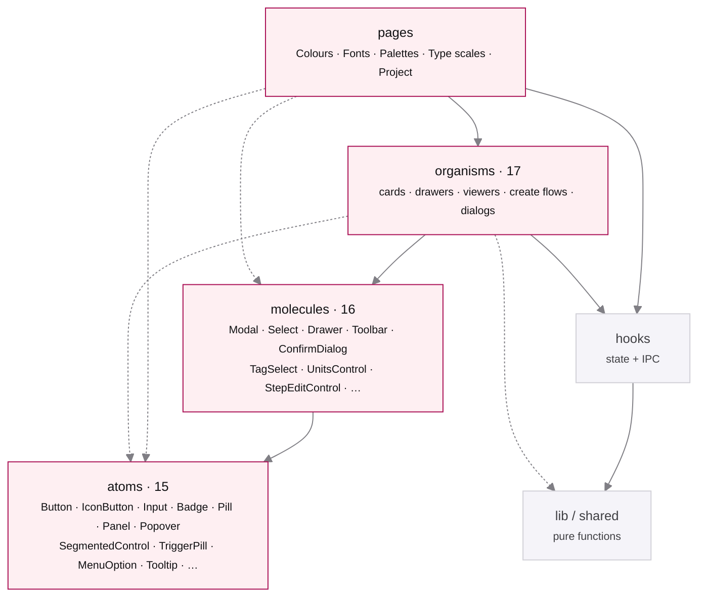

# Vault — Design Notes

Why Vault is built the way it is — the product intent, the architecture, the design system, and
the calls that weren't obvious. This is a decision log, not a spec: I've recorded the choices
that took real thought (and the alternatives I rejected), and skipped the parts the code already
explains. I wear both hats here — designer and engineer — so the reasoning below mixes the two.

## What it is

Vault is an **offline, single-user desktop app for capturing and shaping design tokens** —
colours, fonts, palettes, and type scales. Two jobs:

1. **A library** — capture anything you see in the wild (a hex, a typeface). No project required.
2. **A studio** — gather a project's colours and fonts, then *generate* a palette and a type
   scale from them.

It's deliberately personal software: no accounts, no cloud, no crowd metrics. The library lives
on disk.


> A full visual tour is in [`FEATURE.md`](./FEATURE.md).

---

## Architecture

Electron, three processes, strict boundaries:

```
┌─────────────────────────────────────────────────────────────┐
│ main (Node)                                                  │
│  • better-sqlite3  →  ~/Library/Application Support/Vault     │
│  • IPC handlers (colour / font / palette / type-scale / tag) │
│  • Google Fonts metadata fetch, installed-font enumeration,  │
│    font-file storage (copy bytes into userData/fonts/)       │
└───────────────▲──────────────────────────────────────────────┘
                │ contextBridge — one typed `window.api` (VaultApi)
┌───────────────┴──────────────────────────────────────────────┐
│ preload (isolated)  — thin, declarative ipcRenderer.invoke    │
└───────────────▲──────────────────────────────────────────────┘
                │
┌───────────────┴──────────────────────────────────────────────┐
│ renderer (React + CSS Modules)                                │
│  atoms · primitives · domain · pages · hooks · lib            │
└───────────────────────────────────────────────────────────────┘

shared/  — pure, process-agnostic logic (colour maths, tonal/expressive
           generators, type-scale ramp, palette analysis); no DOM, no Node.
           The palette generators are imported by BOTH main and renderer;
           the type-scale ramp and analyser are renderer-only today.
```

- **Context-isolated, no `nodeIntegration`.** The renderer only ever touches the typed
  `VaultApi` surface; all privileged work (DB, filesystem, network) is in main.
- **`shared/` holds the logic both processes need.** Generators and analysers are pure functions, so the same code can
  drive the live preview in the renderer and the persisted result computed in main. That is what
  the palette handlers do: `palette:create-tonal` and `palette:create-expressive` re-run the
  generator from the seed before writing, so preview and stored result can't drift. Type scales
  are generated once in the renderer and passed to main as rows, so nothing is recomputed there —
  the shared module still holds the ratio presets and the "is this hand-tuned" rule that the
  create flow, viewer and card all read.
- **CI** typechecks, lints, tests, and builds on every push to `main` and every PR; a tagged release builds unsigned
  `.dmg` installers (Apple Silicon + Intel) and publishes them to GitHub Releases. It ships as a
  direct download, not through the App Store — see the README for the one-time Gatekeeper step.

### Data model

SQLite, one file. Two library tables (`colours`, `fonts`), two generated artifacts each with
their own children (`palettes` + `swatches`, `type_scales` + `type_scale_steps`), and a generic
`tags` / `asset_tags` join so any asset can belong to projects.



Generated artifacts (palette, type scale) belong to **exactly one** project and auto-join at
creation; vault items (colour, font) belong to **many**.

`asset_tags` is polymorphic, so SQLite cannot enforce it with a foreign key and cannot cascade
it — the dashed relationships above are held by convention, and cleaning them up on delete is
the application's job.

---

## Design system

- **Tokens first.** Colour, type, spacing, radius, motion, and elevation are CSS custom
  properties. Components never hardcode values (the only literal colours are `#000`/`#fff`
  contrast overlays on swatches, which are intentionally theme-independent).
- **Component taxonomy.** Three levels — atoms, molecules, organisms — matching the vocabulary
  the Figma library uses, so a component has one name in both places. Logic lives in `hooks`;
  pure helpers in `lib`.

  The rule is **never upward**: an atom cannot reach for a molecule, a molecule cannot reach for
  an organism. Same-tier composition is allowed and happens ten times — `ConfirmDialog` is built
  on `Modal`, `StepEditControl` and `UnitsControl` on `Select`, `PaletteView` on `ExportModal`.
  The previous four-level split had zero same-tier imports, and that was worth giving up: the
  fourth level existed only because `primitives/` was holding both base controls and
  compositions, which is the distinction atoms and molecules already make.



Solid arrows are the level ladder; dashed are the shortcuts a level is allowed to take past the
one below it. Nothing points upward.
- **CSS Modules, not Tailwind or inline styles.** Co-located `.module.css` keeps the token
  vocabulary visible and the markup readable, with no runtime styling cost.
- **The same patterns repeat across sections.** Card =
  whole-card button + hover edit pen + `Pill` (descriptor) + mono (value); viewers are
  hero + `Panel`s; create flows are a two-pane (controls | live preview).
- **Accessible by default.** Dialogs, drawers, menus, and popovers are keyboard-navigable and
  dismiss on Escape; focus moves into an overlay on open and returns to the trigger on close;
  focus rings use `:focus-visible` with the accent halo; and all motion respects
  `prefers-reduced-motion`.

---

## Decisions worth recording

### Platform & stack
- **Electron over Tauri.** Mature native APIs (Font Book access, dialogs, dock) and a single
  language across processes mattered more than binary size for a personal desktop tool.
- **better-sqlite3 over an ORM.** Synchronous, zero-ceremony, and the schema is small enough
  that hand-written SQL is clearer than a query builder.
- **CSS Modules over Tailwind.** A bespoke token system is the point; utilities would hide it.
- **No Storybook.** The app already exercises every component; a second harness would be a
  parallel surface to maintain.

### Visual & brand
- **Deep ruby as the *only* accent.** One memorable colour, not a rainbow of UI states.
  Ruby (anchored on `#AA1155` / `#880044`, built as an OKLCH ramp) is reserved for the
  wordmark, primary actions, focus rings, and the active nav item; everything else is calm
  neutral (the `onyx` greys), so the accent reliably means "act here".
- **Manrope, self-hosted.** A geometric-humanist sans with a real weight axis (200–800), bundled
  via `@fontsource-variable/manrope` rather than the Google CDN — a local-first app can't depend
  on a network font. I tried **Cal Sans** for more personality and reverted: it ships weight 400
  only, which flattens the UI's weight hierarchy *and* breaks the type-scale tool, whose entire
  job is demonstrating weight steps.
- **Full-radius pill geometry.** Buttons, nav items, and tags are fully rounded — a soft,
  friendly identity, distinct from the sharp-cornered "devtool" default, applied consistently
  enough that the shape reads as Vault's rather than as decoration.
- **Font Awesome (SVG) over Lucide.** I started on Lucide and switched: FA's solid set sits at a
  more consistent optical weight next to Manrope, and the SVG-React packages tree-shake to only
  the icons used — no icon-font FOUT.
- **Light mode only, on purpose.** A calm, paper-like single theme keeps attention on the
  *content* — the colours and type you're collecting — and concentrated the design work on one
  surface. The two-tier token layer means a dark theme is mostly a matter of overriding the
  semantic aliases: deferred rather than ruled out.

### Colour
- **Perceptual maths (LCH, ΔE2000).** Ramps and "nearest name" run in a perceptual space so
  steps look even and matches read as a human would judge them — not naive RGB distance.
- **Two palette models.** *Tonal* (one seed → semantic ramps) and *Expressive* (several seeds →
  a multi-hue set). Same two-pane create flow, different generator.

### Fonts & type
- **Three sources; two of them app-owned bytes.** **Installed** (enumerated via
  `system_profiler`, the Font Book set) and **file upload** copy the bytes into app storage on
  import, so a moved or deleted original never breaks the vault, and the file stays shareable
  (Show in Finder / Download). **Google** is the exception: adding one stores family, category
  and weights only, and previews render from Google's CDN over a stylesheet link. `Download`
  fetches the `.woff2` on demand and saves it where you choose. Copying Google bytes into the
  vault on add would make the library genuinely offline — it is the obvious next change here.
- **Type-scale presets, not free-form.** *Product* (Display→Label) and *Web/Markup* (h1–h6 +
  paragraph/small) — chosen at creation like tonal/expressive. The chosen ramp is materialised
  into rows, so there's no schema cost and the "kind" is recoverable from the step names.
- **Units are a reading concern, decoupled from storage.** Sizes persist in px, line-heights as
  unitless multipliers, tracking in em; the viewer converts live (px/rem/pt · unitless/px/% ·
  em/px/%) via one popover, and export captures whatever's selected.

### Interaction
- **Four sections, not tabs.** Colours / Fonts / Palettes / Type scales are peers in a sidebar,
  plus an aggregated per-project view.
- **"Projects", not "tags".** Underneath, the schema is a generic `tags` / `asset_tags` join —
  any asset, many tags — because that's the flexible data model. But users don't think in tags;
  they think in the project they're working on. So the UI says *Projects* while the generic join
  stays underneath.
- **Drawer for vault items, page for generated artifacts.** A colour or font is a quick glance
  (drawer); a palette or type scale is a worked object (full page with export).
- **Generated artifacts are immutable after creation.** You tune a type scale while creating it
  (hover-edit per step); the viewer is read-only — same stance as palettes, which don't edit
  swatches post-hoc. Hand-tuning past the ratio flips the meta pill to **Custom**.
- **Favourites are a filter, copy feedback is inline, deletes confirm, duplicates warn.** Small
  consistency rules applied everywhere.
- **⌘K command palette.** A keyboard-first path over the same actions the sidebar and toolbars
  already expose — jump to a section or project, or start a new asset, without reaching for the
  mouse. Every action it offers is also reachable from the sidebar or a toolbar. The fuzzy
  ranking is a pure function (`lib/commandFilter.ts`) with its own unit tests.

---

## Known tradeoffs / next

- **Storage durability.** Data lives in app `userData` — robust against moved files, but not
  backed up. The planned **Phase 2** is an Obsidian-style nominated vault folder (assets +
  data in one portable, sync-able directory).
- **Variable fonts.** Installed-font import reads one weight per face from `system_profiler`;
  variable axes aren't expanded yet.
