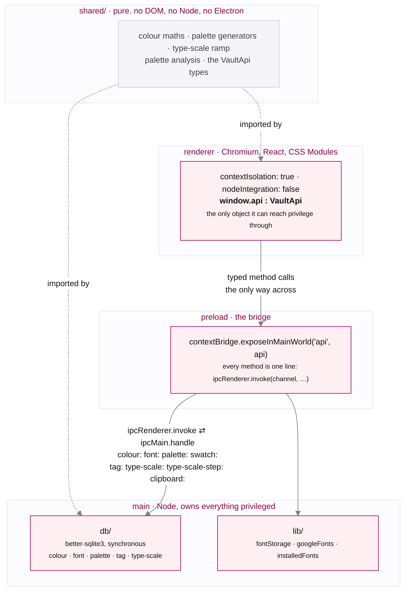
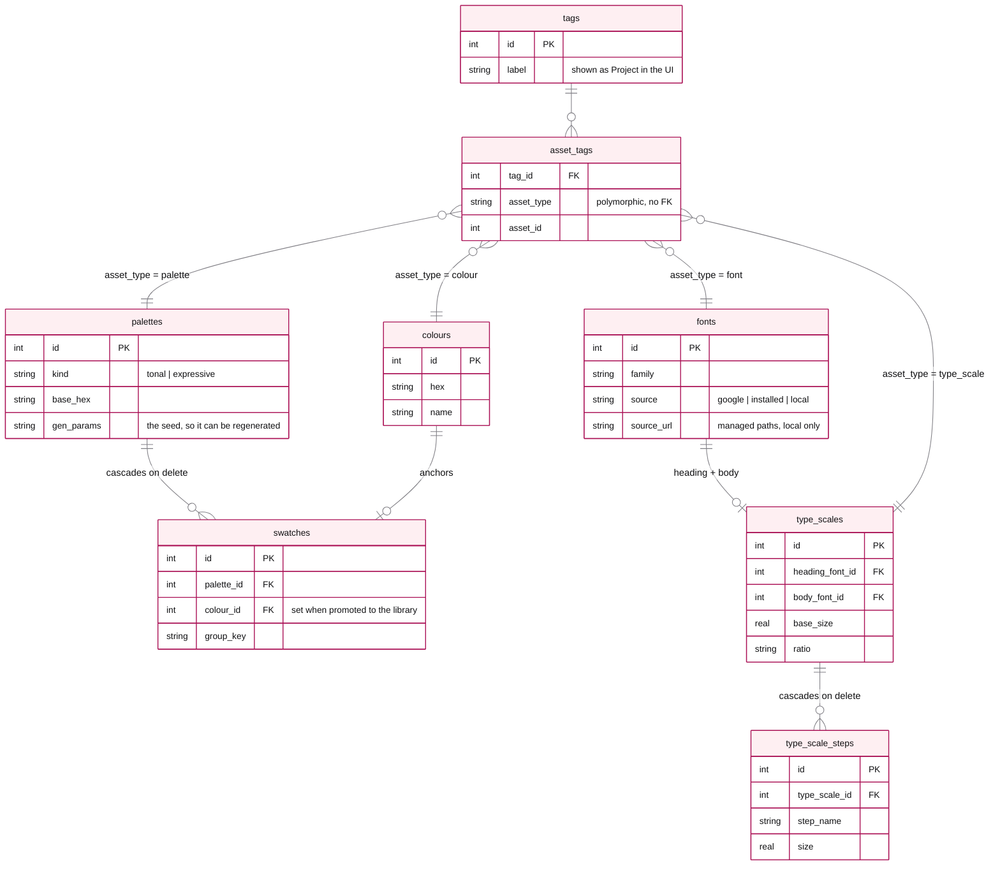
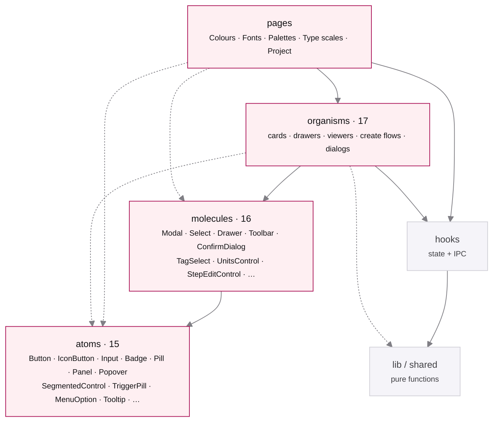

# Vault: Design Notes

Why Vault is built the way it is: the product intent, the architecture, the design system, and
the calls that weren't obvious. This is a decision log rather than a spec. I've recorded the choices
that took real thought (and the alternatives I rejected), and skipped the parts the code already
explains.

## What it is

Vault is an **offline, single-user desktop app for capturing and shaping design tokens**:
colours, fonts, palettes, and type scales. Two jobs:

1. **A library.** Capture anything you see in the wild, a hex or a typeface. No project required.
2. **A studio.** Gather a project's colours and fonts, then _generate_ a palette and a type
   scale from them.

It's deliberately personal software: no accounts, no cloud, no crowd metrics. The library lives
on disk.

> A full visual tour is in [`FEATURE.md`](./FEATURE.md).

---

## Architecture

### What the renderer cannot do

`nodeIntegration: false` means renderer code has no `require`, and `contextIsolation: true` runs
the preload script in a separate JavaScript world from the page. The renderer cannot read the
preload's scope, reach into `ipcRenderer` directly, or monkey-patch its way to Node. It sees
`window.api` and nothing else. Every database write and file read in Vault happens on the far
side of that boundary. Network traffic is the one exception, described below.

### `sandbox: false` is a deliberate trade-off

It lets the preload script use Node built-ins directly, which is what keeps the bridge a single
flat file rather than a second IPC hop. Context isolation still stands, so the renderer remains
cut off from Node. The concession is that the preload script itself is privileged, which is why
it holds no logic: every method on it is a one-line forwarding call.

### Why `shared/` is imported by both processes

The palette generators run in two places on purpose. The renderer runs them to preview a palette
live, and main re-runs them from the same seed before writing to SQLite. The saved palette and
the previewed one therefore cannot drift, because they are the same function over the same
input.

Type scales take the other route. The renderer materialises the steps and main only persists the
rows, so `shared/` there is shared across the renderer's own create flow, viewer and card rather
than across the process boundary. It holds the ratio presets and the rule for what counts as a
hand-tuned scale.

### Outbound traffic

Vault makes three outbound requests, all of them to Google Fonts, and none of them runs unless
you add or preview a font.

| Request                                                               | Where from   | Host                                             |
| --------------------------------------------------------------------- | ------------ | ------------------------------------------------ |
| The family metadata catalogue (`getGoogleFonts`)                      | main         | `fonts.google.com`                               |
| A family's CSS, then its `.woff2` bytes (`font:download-google`)      | main         | `fonts.googleapis.com`, then `fonts.gstatic.com` |
| The stylesheet that renders a Google font in a preview (`fontLoader`) | **renderer** | `fonts.googleapis.com`, then `fonts.gstatic.com` |

The third is the exception to the boundary above. Previewing a Google-sourced font appends a
`<link rel="stylesheet">` to the document, so that request leaves the renderer rather than main.
Everything else stays local: the database, the library, every colour and palette and type scale.
There is no telemetry, no account check, and no update ping.

### The one call that is not IPC

`getPathForFile` is a direct `webUtils` call in the preload rather than an `invoke`. Electron's
file objects no longer expose a filesystem path to the renderer, so this resolves a dropped
`File` to its real path on the privileged side and hands back a string. It reads from the drop
event. Arbitrary renderer input never reaches it.

### Where the rest lives

- **CI** typechecks, lints, formats, tests, and builds on every push to `main` and every pull
  request. A tagged release builds unsigned `.dmg` installers for Apple Silicon and Intel and
  publishes them to GitHub Releases. It ships as a direct download rather than through the App
  Store, and the README has the one-time Gatekeeper step.
- **Runtime floor.** Electron 44 and better-sqlite3 13 both require Node 22, recorded in
  `engines` and `.nvmrc`. The SQLite driver ships N-API prebuilds, so nothing rebuilds it at
  install time; electron-builder still rebuilds at package time through its own copy.
- **Production tree.** Fifteen packages reach the shipped app. React and its scheduler, the
  SQLite driver and its addon API, chroma-js, culori, react-colorful, the icon set, the
  typeface, and two from the haus design system: `haus-colour-utils` for the hue bins and
  `haus-colour-names` for the 31,900-name dataset. Neither adds a transitive dependency;
  `haus-colour-utils` runs on the chroma-js that was already here.

### Data model

SQLite, one file. Two library tables (`colours`, `fonts`), two generated artifacts each with
their own children (`palettes` + `swatches`, `type_scales` + `type_scale_steps`), and a generic
`tags` / `asset_tags` join so any asset can belong to projects.

Generated artifacts (palette, type scale) belong to **exactly one** project and auto-join at
creation; vault items (colour, font) belong to **many**.

`asset_tags` is polymorphic, so SQLite cannot enforce it with a foreign key and cannot cascade
it. The dashed relationships above are held by convention, and cleaning them up on delete is
the application's job.

---

## Design system

- **Tokens first.** Colour, type, spacing, radius, motion, and elevation are CSS custom
  properties. Components never hardcode values (the only literal colours are `#000`/`#fff`
  contrast overlays on swatches, which are intentionally theme-independent).
- **Component taxonomy.** Three levels, atoms then molecules then organisms, matching the vocabulary
  the Figma library uses, so a component has one name in both places. Logic lives in `hooks`;
  pure helpers in `lib`.

  The rule is **never upward**: an atom cannot reach for a molecule, a molecule cannot reach for
  an organism. Same-tier composition is allowed and happens ten times. `ConfirmDialog` is built
  on `Modal`, `StepEditControl` and `UnitsControl` on `Select`, `PaletteView` on `ExportModal`.
  The previous four-level split had zero same-tier imports, and that was worth giving up: the
  fourth level existed only because `primitives/` was holding both base controls and
  compositions, which is the distinction atoms and molecules already make.

Solid arrows are the level ladder; dashed are the shortcuts a level is allowed to take past the
one below it. Nothing points upward.

- **CSS Modules.** Co-located `.module.css` keeps the token vocabulary visible and the markup
  readable, with no runtime styling cost. Tailwind and inline styles both move the vocabulary
  into the markup, which is the thing this system is trying to keep out of it.
- **The same patterns repeat across sections.** Card =
  whole-card button + hover edit pen + `Pill` (descriptor) + mono (value); viewers are
  hero + `Panel`s; create flows are a two-pane (controls | live preview).
- **Accessible by default.** Every overlay dismisses on Escape. Dialogs and drawers share one
  `useFocusTrap`: focus moves to the first control on open, Tab cycles inside the overlay, and
  focus returns to whatever opened it on close. Focus rings are `:focus-visible` with the accent
  halo, and all motion respects `prefers-reduced-motion`.

  The exception is the command palette, which manages its own focus because it is a combobox
  driven by `aria-activedescendant` and arrow keys rather than by Tab.

---

## Decisions

### Platform & stack

- **Electron over Tauri.** Mature native APIs (Font Book access, dialogs, dock) and a single
  language across processes mattered more than binary size for a personal desktop tool.
- **better-sqlite3 over an ORM.** Synchronous, zero-ceremony, and the schema is small enough
  that hand-written SQL is clearer than a query builder.
- **CSS Modules over Tailwind.** A bespoke token system is the point; utilities would hide it.
- **No Storybook.** The app already exercises every component; a second harness would be a
  parallel surface to maintain.

### Visual & brand

- **Deep ruby carries every action.** Ruby (anchored on `#AA1155` / `#880044`, built as an
  OKLCH ramp) is reserved for the wordmark, primary actions, focus rings, and the active nav
  item. One amber (`--amber-500`) sits outside that rule, on the favourite star, because a
  marker of state should not read as something to click. Everything else is calm
  neutral (the `onyx` greys), so the accent reliably means "act here".
- **Manrope, self-hosted.** A geometric-humanist sans with a real weight axis (200–800), bundled
  via `@fontsource-variable/manrope` rather than the Google CDN, because a local-first app can't depend
  on a network font. I tried **Cal Sans** for more personality and reverted: it ships weight 400
  only, which flattens the UI's weight hierarchy _and_ breaks the type-scale tool, whose entire
  job is demonstrating weight steps.
- **Full-radius pill geometry.** Buttons, nav items, and tags are fully rounded, giving a soft,
  friendly identity, distinct from the sharp-cornered "devtool" default, applied consistently
  enough that the shape reads as Vault's rather than as decoration.
- **Font Awesome (SVG) over Lucide.** I started on Lucide and switched: FA's solid set sits at a
  more consistent optical weight next to Manrope, and the SVG-React packages tree-shake to only
  the icons used, so there is no icon-font FOUT.
- **Light mode only, on purpose.** A calm, paper-like single theme keeps attention on the
  _content_, the colours and type you're collecting, and concentrated the design work on one
  surface. The two-tier token layer means a dark theme is mostly a matter of overriding the
  semantic aliases: deferred rather than ruled out.

### Colour

- **Perceptual maths (LCH, ΔE2000).** Ramps and "nearest name" run in a perceptual space so
  steps look even and matches read as a human would judge them. RGB distance puts colours close
  together that do not look alike.
- **The hue bins come from `haus-colour-utils`.** vault carried its own copy with the same
  shape and the boundaries of an HSL wheel, which is a different wheel: sRGB red is OKLCH hue
  29, not 0, so every family sat about one bin anticlockwise of where it belonged and 17 of 27
  canonical colours were misnamed. The bins are a shared decision, so they live in one place
  and vault reads them.
- **The name dataset comes from `haus-colour-names`.** 31,900 names, previously a 764KB
  `colornames.json` committed here and a second copy in hexicon.
- **The naming search stays here.** `haus-colour-utils` has the same two passes in
  `createNamedColourMatcher`, but it returns a ranked top-N, and this needs the confidence
  bands, which count every candidate inside the scan radius by distance band, and the
  de-duplication by name that makes the runner list read as alternatives. Delegating would mean
  asking for the whole pool and re-deriving both here.
- **Two palette models.** _Tonal_ (one seed → semantic ramps) and _Expressive_ (several seeds →
  a multi-hue set). Same two-pane create flow, different generator.

### Fonts & type

- **Three sources; two of them app-owned bytes.** **Installed** (enumerated via
  `system_profiler`, the Font Book set) and **file upload** copy the bytes into app storage on
  import, so a moved or deleted original never breaks the vault, and the file stays shareable
  (Show in Finder / Download). **Google** is the exception: adding one stores family, category
  and weights only, and previews render from Google's CDN over a stylesheet link. `Download`
  fetches the `.woff2` on demand and saves it where you choose. Copying Google bytes into the
  vault on add would make the library genuinely offline, and it is the obvious next change here.
- **Two type-scale presets.** _Product_ (Display→Label) and _Web/Markup_ (h1–h6 +
  paragraph/small), chosen at creation the way tonal and expressive are. The chosen ramp is materialised
  into rows, so there's no schema cost and the "kind" is recoverable from the step names.
- **Units are a reading concern, decoupled from storage.** Sizes persist in px, line-heights as
  unitless multipliers, tracking in em; the viewer converts live (px/rem/pt · unitless/px/% ·
  em/px/%) via one popover, and export captures whatever's selected, with one exception:
  `letter-spacing` takes no percentage in CSS, so a tracking reading of `-2%` exports as
  `-0.02em`. The viewer keeps the percentage because that is how type is discussed.

### Interaction

- **Four sections in a sidebar.** Colours, Fonts, Palettes and Type scales are peers,
  plus an aggregated per-project view.
- **The interface says "Projects".** Underneath, the schema is a generic `tags` / `asset_tags` join:
  any asset, many tags, because that's the flexible data model. But users don't think in tags;
  they think in the project they're working on. So the UI says _Projects_ while the generic join
  stays underneath.
- **Drawer for vault items, page for generated artifacts.** A colour or font is a quick glance
  (drawer); a palette or type scale is a worked object (full page with export).
- **Generated artifacts are immutable after creation.** You tune a type scale while creating it
  (hover-edit per step); the viewer is read-only, the same stance as palettes, which don't edit
  swatches post-hoc. Hand-tuning past the ratio flips the meta pill to **Custom**.
- **Favourites are a filter, copy feedback is inline, deletes confirm, duplicates warn.** Small
  consistency rules applied everywhere.
- **⌘K command palette.** A keyboard-first path over the same actions the sidebar and toolbars
  already expose: jump to a section or project, or start a new asset, without reaching for the
  mouse. Every action it offers is also reachable from the sidebar or a toolbar. The fuzzy
  ranking is a pure function (`lib/commandFilter.ts`) with its own unit tests.

---

## Known tradeoffs / next

- **Storage durability.** Data lives in app `userData`, which is robust against moved files but not
  backed up. The planned **Phase 2** is an Obsidian-style nominated vault folder (assets +
  data in one portable, sync-able directory).
- **Variable fonts.** Installed-font import reads one weight per face from `system_profiler`;
  variable axes aren't expanded yet.
