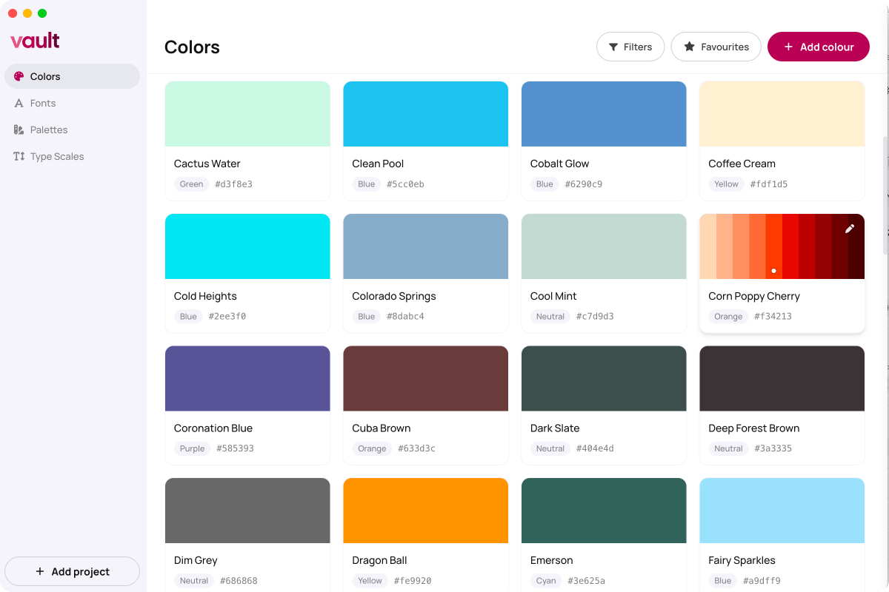
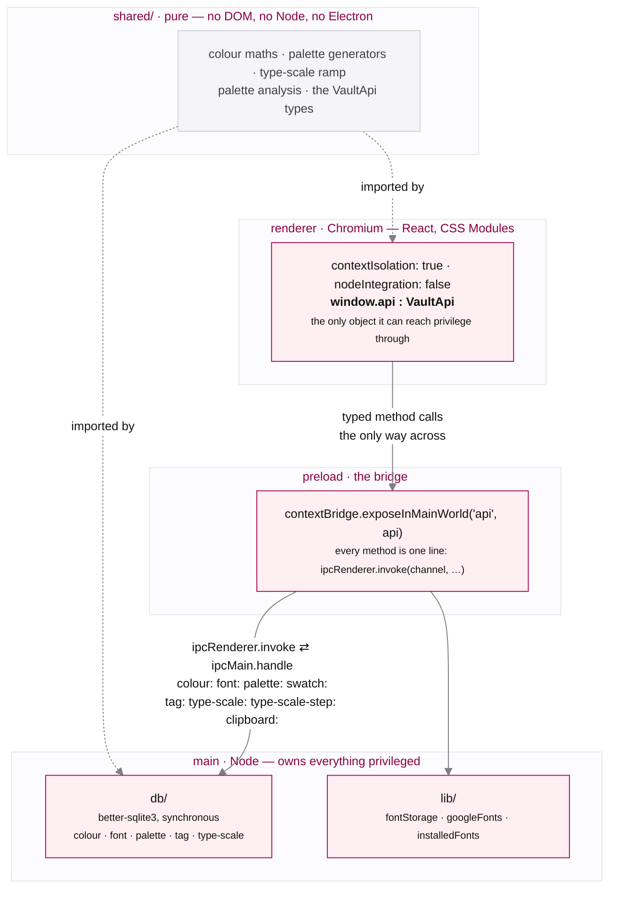

# Vault

An offline, single-user desktop app for capturing and shaping design tokens — **colours,
fonts, palettes, and type scales** — built with Electron, React, and SQLite.



## Features

- **Colours** — capture hexes, auto-named, with perceptual ramps and contrast checks.
- **Fonts** — add from Google Fonts, your installed fonts (Font Book), or a file; preview at
  any size; grab the file back out.
- **Palettes** — generate tonal systems or expressive multi-hue sets from your library, then
  export (CSS / SCSS / Design Tokens / Tailwind).
- **Type scales** — Product or Web/Markup presets on a ratio, live unit conversion
  (px / rem / pt …), per-step tuning, and the same four export formats.
- **Projects** — tag any asset; view everything for a project in one place.
- **Command palette** — `⌘K` to jump to any section or project, or start a new asset, without
  leaving the keyboard.

Everything is local. No accounts, no cloud. Your library lives in
`~/Library/Application Support/Vault/` (SQLite database + copied font files) and never
leaves your machine.

## Engineering highlights

- **Two-tier OKLCH token system.** Raw primitives → semantic intent aliases, layered with
  native CSS `@layer`; perceptual colour ramps, relative-colour syntax (`oklch(from … )`), and
  full space / radius / shadow / z-index / motion scales. Components never hardcode values.
- **One source of truth across processes.** `shared/` holds pure, DOM- and Node-free logic —
  colour maths, the palette generators, the type-scale ramp, palette analysis. The palette
  generators are imported by **both** main and renderer: the renderer previews with them and
  main re-runs them from the seed before writing, so the saved palette and the previewed one
  can't drift. Type scales take the other route — the renderer materialises the steps and main
  only persists the rows — so there the shared module is shared across the renderer's own
  create flow, viewer and card rather than across processes.
- **Perceptual colour throughout.** "Nearest name" is a two-pass CIE76 → CIEDE2000 search over a
  ~31,900-name dataset; ramps, grouping, and contrast all reason in perceptual space (LCH/OKLCH),
  not RGB distance.
- **Typed IPC boundary.** A context-isolated renderer (no `nodeIntegration`) reaches Node only
  through a single typed `window.api` (`VaultApi`) surface; all database and filesystem work lives in main. Font previews are the one
  exception — see *Outbound traffic* below.
- **Tested logic, gated in CI.** 99 Vitest unit tests over the pure `lib/` functions — the
  exporters, the colour maths, the type-scale units and the command filter — run alongside
  lint + typecheck on every push. The palette generators are not yet covered.
- **Local-first.** Synchronous better-sqlite3, with the bytes of uploaded and installed fonts
  copied into `userData`. Colours, palettes and type scales work with no network at all; a font
  added from Google is stored as a reference and renders from Google's CDN.

## Architecture

Three processes, one typed boundary, and a pure core shared across it.



The renderer holds no `require`, no `fs`, and no database handle. `shared/` is the one module
both sides import, and the four notes below are why each of those choices was made.

**What the renderer cannot do.** `nodeIntegration: false` means renderer code
has no `require`, and `contextIsolation: true` runs the preload script in a separate JavaScript
world from the page. The renderer cannot read the preload's scope, reach into `ipcRenderer`
directly, or monkey-patch its way to Node. It sees `window.api` and nothing more. Every database
write and file read in Vault happens on the far side of that boundary. Network is the one
exception, and it is described below.

**`sandbox: false` is a deliberate trade-off.** It lets the preload script use Node built-ins
directly, which is what keeps the bridge a single flat file instead of a second IPC hop. Context
isolation still stands, so the renderer remains cut off from Node; the concession is that the
preload script itself is privileged. That is why it holds no logic: every method on it is a
one-line forwarding call.

**Why `shared/` is imported by both processes.** The palette generators run in two places on
purpose. The renderer runs them to preview a palette live, and main re-runs them from the same
seed before writing to SQLite. The saved palette and the previewed one therefore cannot drift,
because they are the same function over the same input.

Type scales take the other route: the renderer materialises the steps and main only persists the
rows. There, `shared/` is shared across the renderer's own create flow, viewer and card rather
than across the process boundary.

**Outbound traffic is Google Fonts and nothing else.** Three requests, across three hosts, none
of which runs unless you go looking for a font:

| Request | Where from | Host |
|---|---|---|
| The family metadata catalogue (`getGoogleFonts`) | main | `fonts.google.com` |
| A family's CSS, then its `.woff2` bytes (`font:download-google`) | main | `fonts.googleapis.com`, then `fonts.gstatic.com` |
| The stylesheet that renders a Google font in a preview (`fontLoader`) | **renderer** | `fonts.googleapis.com`, then `fonts.gstatic.com` |

The third is the exception to the boundary above: previewing a Google-sourced font appends a
`<link rel="stylesheet">` to the document, so that request leaves the renderer rather than main.
Everything else — the database, the library, every colour and palette and type scale — is local.
There is no telemetry, no account check, and no update ping.

**The one call that is not IPC.** `getPathForFile` is a direct `webUtils` call in the preload,
not an `invoke`. Electron's file objects no longer expose a filesystem path to the renderer, so
this resolves a dropped `File` to its real path on the privileged side and hands back a string.
It reads from the drop event, never from arbitrary renderer input.

## Install

Vault is a direct-download Mac app — not on the App Store, no account required.

1. Download the `.dmg` for your Mac from [Releases](../../releases): `Vault-<version>-arm64.dmg`
   for Apple Silicon, `Vault-<version>.dmg` for Intel.
2. Open it and drag **Vault** into Applications.
3. **First launch only.** The build is unsigned, so macOS quarantines it on download.
   Clear the quarantine once:

   ```bash
   xattr -cr /Applications/Vault.app
   ```

   Then open Vault normally. (Right-click → Open also works on some macOS versions.)

## Develop

```bash
npm install      # rebuilds better-sqlite3 for Electron via postinstall
npm run dev      # launch the app with HMR
```

## Scripts

| Command | Does |
|---|---|
| `npm run dev` | Run the app (electron-vite, HMR) |
| `npm run typecheck` | `tsc --noEmit` across main + renderer |
| `npm run test` | Vitest (watch) over the pure `lib/` logic |
| `npm run test:run` | Vitest once (CI) |
| `npm run lint` | ESLint (typescript-eslint + react-hooks) |
| `npm run format` | Prettier write |
| `npm run build` | Production build |
| `npm run dist:mac` | Unsigned `.dmg` (arm64 + Intel) |

## More

- [`FEATURE.md`](./FEATURE.md) — a visual tour of every feature.
- [`DESIGN.md`](./DESIGN.md) — architecture, the design system, and the decisions behind the build.

## Stack

Electron · React · TypeScript · CSS Modules · better-sqlite3 · electron-vite
